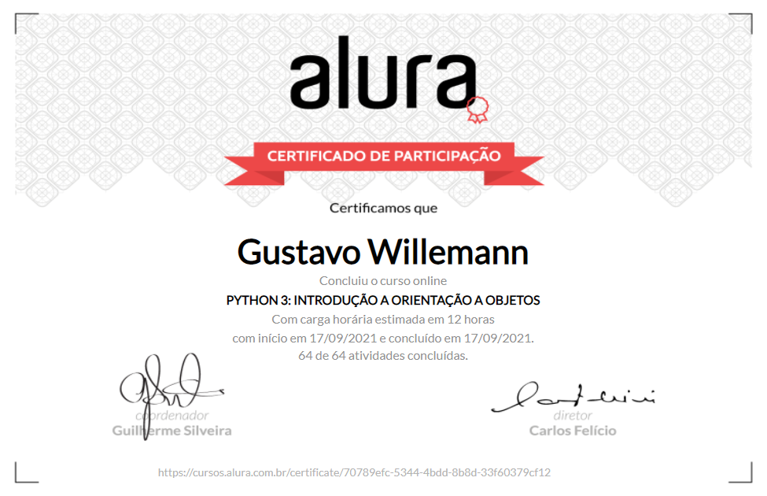

# Python 3: Introdução a Orientação a objetos

Repositório do conjunto de projetos elaborados durante o curso:

- [Python 3: Introdução a Orientação a objetos](https://cursos.alura.com.br/course/python-3-intro-orientacao-objetos)

 

## Certificados

 

