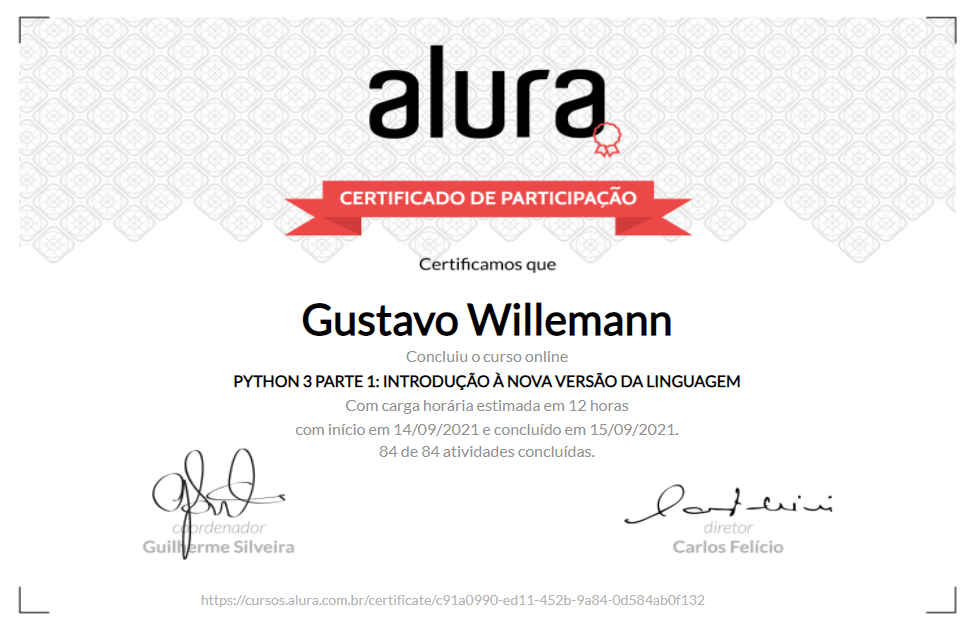
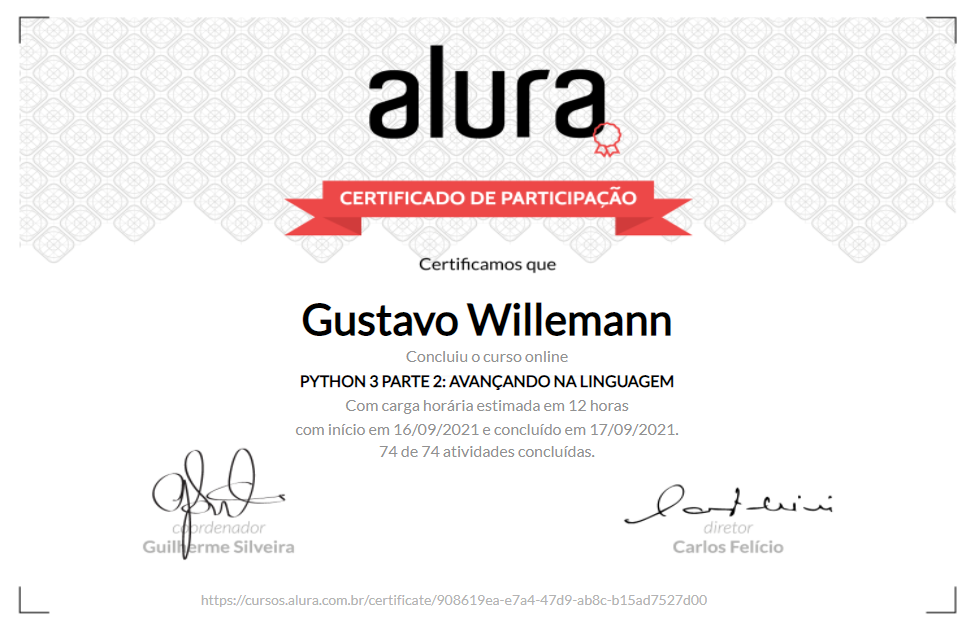

# Python 3: Cursos Introdutórios

Repositório do conjunto de projetos elaborados durante os cursos introdutórios da linguagem:

- [Python 3 parte 1: Introdução à nova versão da linguagem](https://cursos.alura.com.br/course/python-3-introducao-a-nova-versao-da-linguagem)

- [Python 3 parte 2: Avançando na linguagem](https://cursos.alura.com.br/course/python-3-avancando-na-linguagem)

 

## Certificados

 

 
 

