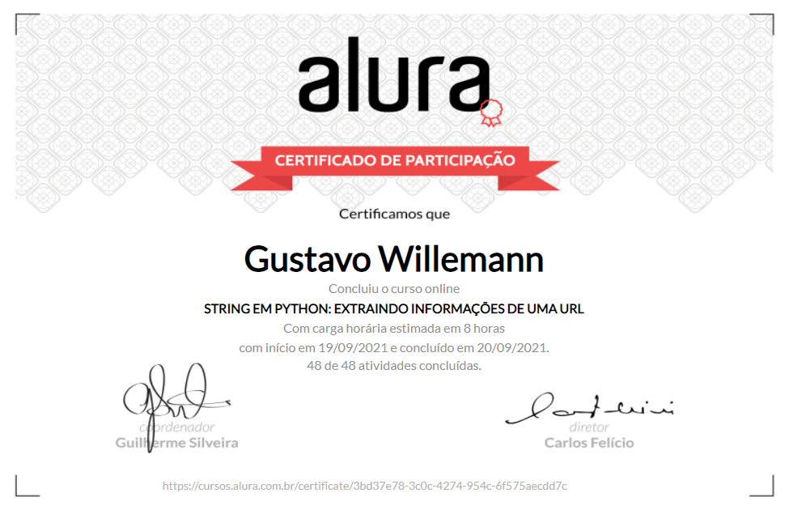

# String em Python: Extraindo informações de uma URL

Repositório do conjunto de projetos elaborados durante o curso:

- [String em Python: Extraindo informações de uma URL](https://cursos.alura.com.br/course/string-python-extraindo-informacoes-url)

 

## Certificados

 

